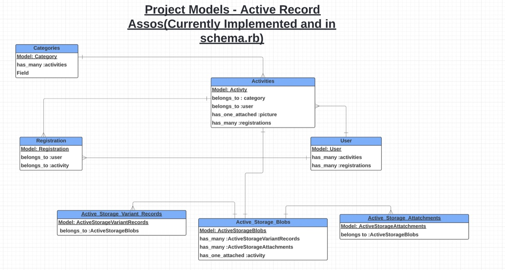

# My-Kid-Activity Booking & Organiser App
## R7: Identification of the Problem

The motivation behind the design of the My-Kid-Activity app was to solve a whole host of problems that are currently experienced by both parents and various Extracaricular Activities Service Providers when trying to organise different activities for children, outside school hours. To understand all the problems, it is first necessary to understand a basic model on how parents and providers go about the business currently. This can be understood by obserivng the illustration in Figure 1 below.

*Figure 1 The current model of delivering Extracaricular activities*

As it states above there is currently nothing to bring/co-ordinate the two groups, which leads to both of them  working in isolation. Parents as a result rely on media and personal networks to find and assess the various programs.

Providers to get themselves known will have to pay for very expensive marketing. They sometimes have to rely on volunteers or even have to budge paying admin staff to co-ordinate everything. They also may have to deal taking payments which brings which comes with its own risks. They also may have to deal with scheduling an co-ordinating which is a very difficult task too. Another issue is they also have no access to any history of the children's previous activities which would be useful to help in their current training. Hence the problems these two parties face can be sumarised in Figure 2 below:

*Figure 2 Problems assosciated with Extracaricular activities*

As illustrated in Figure 2 above, it shows that Parents are firstly having to pay very high costs due to the high cost of running the business by the providers. The reasons for this is because businesses are having to pay high markenting, software and admin fees. This is getting passed down to the parents. Parents also have to pay go through complex booking and payment processes. Even the most connected of parents also find it hard to find and evaluate all the programs in the market.

Hence it was neccessary to design the My-Kid-Activity App to bring both sides together and try solve the problems highlighted in Figure 2.

*Figure 3 Brief defenition of My-Kid-Activity APP*

As shown in Figue 3, the App allows providers to register their programs in there which makes it easiy assesible to both parties and solving all the problems highlighted in Figure 3 as shown in Figure 4 below.

*Figure 4 Brief defenition of My-Kid-Activity APP*

As shown above hence the "My Kid Activity" app is designed to firstly help all parents to be able to easily find quality and affordable extracaricular activities for their children. The app will allow parents to explore, evaluate, book and manage their child's/children's extracaricular activities. It will also help providers save costs and a lot of unecessary headaches, so that they can eventually fully focus on all their energies and resources to provide good, quality programs.

## R8: Need to Solve the Problem

These days with parents are bussier thatn ever and extra-caricular activities are deemed more important than ever too. Hence it is very important to be able to fix up the whole system and unfortunately there is nothing in the market that comes close to what My-Kid-Activity App can provide.

## R9: Application URL

https://morning-garden-60590.herokuapp.com/activities

## R10: GitHub Repository Link

https://github.com/Anup-SoftwareDev/MyKid_Activity_app

## R11: Description of Marketplace App

### Purpose
### Functionality / Features
### Sitemap
### Screenshots
### Target Audience
### Tech Stack

## R12: User Stories
## R13: Wireframes
## R14: Entity Relationship Diagrams

The ERD diagram for My-Kid-Activity app is shwon if Figure R14 below. The enities with **blue** headers are the ones **implemented currently**. The ones in **orange** are the ones **not implemented** yet but planned to be implemented in the future.

Figue R14: ERD Diagram of My-kid activity app.
## R15: High Level Components 
## R16: Third Party Services
## R17: Project Models - Active Record Assosciations

## R18: Database Relations

## R19: Database Schema Design
## R20: Allocation of Taskes and Management
