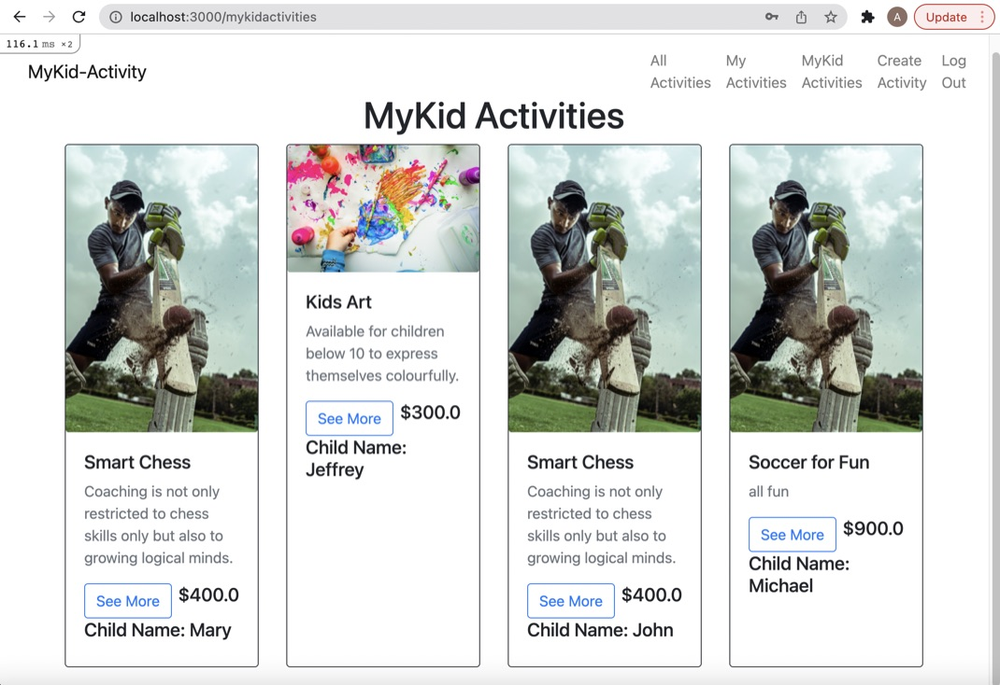
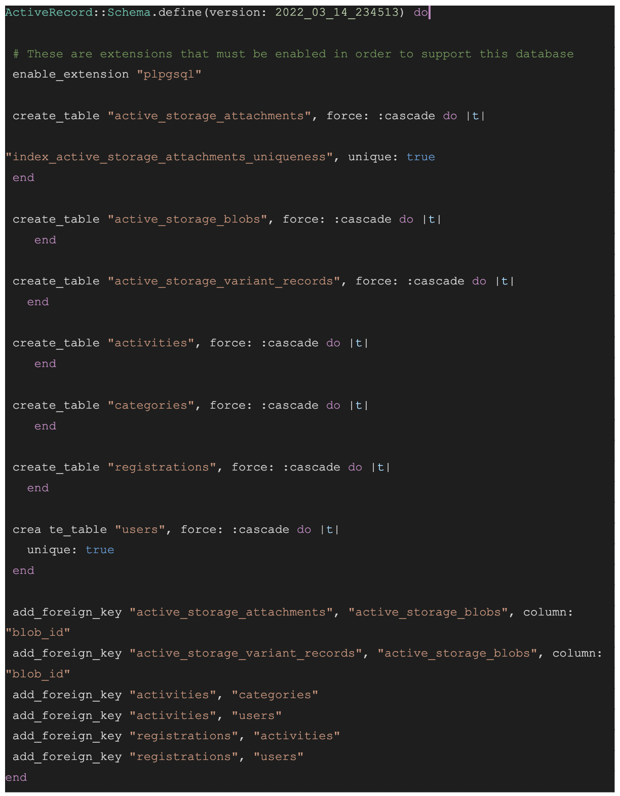

# My-Kid-Activity Booking & Organiser App
## R7: Identification of the Problem

The motivation behind the design of the My-Kid-Activity app was to solve a whole host of problems that are currently experienced by both parents and various Extracaricular Activities Service Providers when trying to organise different activities for children, outside school hours. To understand all the problems, it is first necessary to understand a basic model on how parents and providers go about the business currently. This can be understood by obserivng the illustration in Figure 1 below.

*Figure 1 The current model of delivering Extracaricular activities*

As it states above there is currently nothing to bring/co-ordinate the two groups, which leads to both of them  working in isolation. Parents as a result rely on media and personal networks to find and assess the various programs.

Providers to get themselves known will have to pay for very expensive marketing. They sometimes have to rely on volunteers or even have to budge paying admin staff to co-ordinate everything. They also may have to deal taking payments which brings which comes with its own risks. They also may have to deal with scheduling an co-ordinating which is a very difficult task too. Another issue is they also have no access to any history of the children's previous activities which would be useful to help in their current training. Hence the problems these two parties face can be sumarised in Figure 2 below:

*Figure 2 Problems assosciated with Extracaricular activities*

As illustrated in Figure 2 above, it shows that Parents are firstly having to pay very high costs due to the high cost of running the business by the providers. The reasons for this is because businesses are having to pay high markenting, software and admin fees. This is getting passed down to the parents. Parents also have to pay go through complex booking and payment processes. Even the most connected of parents also find it hard to find and evaluate all the programs in the market.

Hence it was neccessary to design the My-Kid-Activity App to bring both sides together and try solve the problems highlighted in Figure 2.

*Figure 3 Brief defenition of My-Kid-Activity APP*

As shown in Figue 3, the App allows providers to register their programs in there which makes it easiy assesible to both parties and solving all the problems highlighted in Figure 3 as shown in Figure 4 below.

*Figure 4 Brief defenition of My-Kid-Activity APP*

As shown above hence the "My Kid Activity" app is designed to firstly help all parents to be able to easily find quality and affordable extracaricular activities for their children. The app will allow parents to explore, evaluate, book and manage their child's/children's extracaricular activities. It will also help providers save costs and a lot of unecessary headaches, so that they can eventually fully focus on all their energies and resources to provide good, quality programs.

## R8: Need to Solve the Problem

These days with parents are bussier thatn ever and extra-caricular activities are deemed more important than ever too.
According to a rescent study there is generally 8 benefits to children for doing extracaricular activities(Crimson, 2021):

- improves academic performance
- allows kids to explore
- broader interests and get broader perspective on things
- Gives them social opportunities which leads to limitless options to succeed
- Is a major boost to confidence,
- learn priceless life skills like public speaking.
- the activities provide good refferences for the future
- Could help with university admission in the future

 Hence it is very important to be able to fix up the whole system and unfortunately there is nothing in the market that comes close to what My-Kid-Activity App can provide.

Refference:

Crimson, 2021. 8 benefits of Extracaricular activities for High school students. https://www.crimsoneducation.org/au/blog/extracurriculars/benefits-of-extracurricular-activities/ (Accessed 20 March 2022)

## R9: Application URL

https://morning-garden-60590.herokuapp.com/activities

## R10: GitHub Repository Link

https://github.com/Anup-SoftwareDev/MyKid_Activity_app

## R11: Description of Marketplace App

### Purpose

The purpose of the app is to make the lives of parents and providers of extracaricular activities easier. The purpose from a parents point of view is to ensure they have an app that makes it easier for them to search, evaluate, book, manage and pay for their children's extracarricular activities. It also hopes to eventually provide better quality and more affordable programs.

From a provider point of view it tries to ensure that providers can pay less for marketing, and employing staff. It also tries to free them from all other business complications like legal issues, handling sensitive information and dealing with payments.

### Functionality / Features

It allows the following features for both stakeholders:

#### Parents:
- Search easily for programs
- Book easily for programs
- Evaluate programs easily with reviews and information
- manage and provide alerts on a daily basis for the programs
- pay easily and securely for the bookings.
- Get information on perfomance of children

#### Providers
- Register their programs easily and get known without having to market
- do admin functions.
- send alerts and notification to parents when schedules change.
- perform payments.
- guide on all legal issues when running a business.

### Sitemap

### Screenshots

- Home Page:

- All Activities Page:

- Individual Activity Page:

- My Activity Tablet view:

- My Activity Mobile view:

MyKid activities:

### Target Audience

The target audiences are any parent that has school going kids and any providers of children's extracaricular activities.

### Tech Stack

- Ruby on Rails framework
- PostgreSQL
- Bootstrap
- Javascript
- HTML
- CSS & SCSS
- Heroku

## R12: User Stories

There are two main stake holders in the Marketplace app (Parents and Providers). Now to create User stories from both their perspectives using the following statement:

“As a [persona], I [want to], [so that].”

### Parents

As a parent, I :

- want to find want to be able to search for programs for my children easily, so I can catch up on the long list of other things to do

- want to be able to choose good quality programs that are affordable, so I can give my kids the best exposure possible.

- want to be able to evalute the quality of the programs accurately so that my mind is at ease that, I have makd the right choice for my children.

- want the booking proces to be simple and transparent so that I do not get surprised by the cost and stress about my budget.
- want something that will easily give me scedules on a daily basis so that I do not have to stress phoning around and feel guilty when I miss appointments.

- want a payment procedure that is simple and accountable so that i do not have to worry about missing payments or wondering if I have overpaid.

### Providers

As a provider, I:

- want to be able to be accesible and known to all the parents without having to pay a fortune for marketing, so that I can afford to provide very good quality service, which is something I am good at.

- want something that will take care of payments, so that i can avoid the risk around payments so that I can focus on my core business with less risk.

- want that will take care of all the admin tasks required, so that I can again spend less money on hiring people and begging volunteers.

- want some thing that will alert all parents when scedules change so that I do not have to stress about not being able to reach everybody.

## R13: Wireframes

### Home Page

* Not Logged-in

* Logged in

### All Activities page

* Not Logged-in

* Logged-in

### Individual Activity page

* Not Logged-in

* Logged-in

### MyKid Activty - Parent Mode

### My Activty - Provider Mode

## R14: Entity Relationship Diagrams

The ERD diagram for My-Kid-Activity app is shwon if Figure R14 below. The enities with **blue** headers are the ones **implemented currently**. The ones in **orange** are the ones **not implemented** yet but planned to be implemented in the future.

Figue R14: ERD Diagram of My-kid activity app.
## R15: High Level Components 

The app has been programmed predominantly using Ruby on rails which is essentially following a MVC (Model, View and Controller) Architecture. This architecture is together forms the Ruby on Rails framework which is composed of 6 components or smaller frameworks. These smaller frameworks are the following:

- **Active Record:** This component plays a major role when working with databases. Classes are a big part of working with models and writig to databases. Active Record allows developers to write minimal code to ensure all this happens smoothly.
- **Active Model:** This is very important because it provides the interface for the moder part of the Model view controller.

- **Active Support:** This is a listo of extensions that make it easy to work with rails applications.

- **Action Mailer:** This is a layer that will be taken advantage of in the more advanced programming stage of the application. It provides a layer to deal with emails and other requirements around that.

- **Active Resource:** This is another feature that helps us write minmal code when dealing with databases. This helps a develper to make API's very easily. Active Resource allows us to use REST conventions and hence be able to obtain information form databases so much easier.

- **Action Pack:** This is the framework in rails that deals with responses and requests. It provides web requests, handling, routing, and view generation. Then in order to provide views it would choose controllers and generate views as required.

## R16: Third Party Services

The two 3rd party services made use off in this app was the S3 bucket through Amazon Web Services and Stripe payment system to deal with payments.

### S3 Bucket: 

This is a very affordable service provided by Amazon Web Services once we sign in with them. S3 make use of block storage and has the capacity to hold large volumes of both sturctured and unstrutured data for almost no cost. This save developers from having to save large images and videos into the App. This would end up making the build process and the application processing time slower once deployed. Hence the S3 bucket was esential considering the amount of pictures we would need to us in a Marketplace app.

### Stripe Payment:

This is another feature that saves the developer and the business using the app from a lot of headache. Stripe is a feature that can take care of all payment done in an application. Once the customers have to do payment the application will root to the Stripe website, where the customers can securely enter their credit card details and process the payment. The figure below shows how this app directs the customers to the sttripe payment website:

Dealing with payment and payment details are a major headache and this can lead to a lot of leagal implications once things go wrong.

Installing webhook with strip can also provide the business with more records and validation for the ttransaction. This will be dealt with in the next stage of development.

## R17: Project Models - Active Record Assosciations

The figure below shows all the models as it appears in schema.rb. All these models have been fully implemented and the Active record assosciations are as described in the figure below:

In the figure above it can be seen Activities model belongs to category and user model while in return User and category have a one-many relationship with Activities.

The figure below however shows mostly models in orange which are models that have not been implemented yet, however their Active record assosciations have been designed as shown below:

## R18: Database Relations

The figure below shows all the models as it appears in schema.rb. All these models have been fully implemented and the Database relations are as described in the figure below:

The figure below however shows mostly models in orange which are models that have not been implemented yet, however their Database relations have been designed as shown below:

## R19: Database Schema Design

A basic outline  of the file schema.rb is put below with all the internal code removed.

When comparing this to the ERD Figure R14 in Question R14 it can be noticed that all the blue entities have beem implemented and the orange ones are missing. The blue ones are adequate for the app to run at a very basic level, However the orange ones would help it be more advanced. The new orange ones are the following entities:

* Parent Reviews - This will bring in the feature where parents can leave reviews and help other parents in choosing the program. THis is an integral part of the app because evaluating in the traditional sense is very difficult.
* Child - Currently the child's name is only stored in the bookings along with the parent's name. However for the app to be fully functional in the realworld, a separate child entity needs to be opened to store the large amount of data that is necessay inrelation to the child. This could be like previous medical conditions, food allergies and relitious food prefferences.
* User profile - A separate user profile will also be needed when scaling up because there would be a lot information required to be sored about the user.
* food_allergyreligion -  This would be a long list of food prefferences in terms of religion and health. A separate enity would be required because these lists are always growing and it is possible that some children would have more than one prefference.
* med condition -  previous and current medical conditions is absolutely critical for the running of a professional app for safety and legislative reasons.

Ther is also to join tables:

* Child_med_cond - a child could have many medical conditions and a condition could be found in many children and hence this join table will be needed.
* Child_food allergy_religion - as mentioned before the relation between a child and food prefference could be a many to many relation and hence another join table.

## R20: Allocation of Taskes and Management

All tasks for the project were carefully chosen and tracked using "Trello". A link to the "Trello board" is put below:

https://trello.com/b/VwNQwa5Y/mykidactivity-app

As it can be seen from the board the projct was divided into the following 3 main categories:

* Documention - using the yellow tag.
* Presentation - using the green tag.
* Coding - using the purple tag.

Each of these main categories were broken down somemore and monitored at different stages.

Screenshots below show the progress of the Trello board at two different stages of the poject:

### Middle Stage:

### Final Stage:

